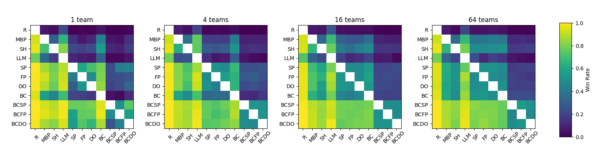

# VGC-Bench

[](https://github.com/cameronangliss/vgc-bench/actions/workflows/tests.yml)
[](https://github.com/cameronangliss/vgc-bench)
[](LICENSE)
[](https://arxiv.org/abs/2506.10326)

This is the official code for [VGC-Bench: Towards Mastering Diverse Team Strategies in Competitive Pokémon](https://arxiv.org/abs/2506.10326).

This benchmark includes:
- multi-agent reinforcement learning (RL) with 4 Policy Space Response Oracle (PSRO) algorithms to fine-tune an agent initialized either randomly or with the output of the BC pipeline
- a behavior cloning (BC) pipeline to gather human demonstrations, process them into state-action pairs, and train a model to imitate human play
- a basic Large Language Model (LLM) player that any LLM can easily be plugged into
- 3 heuristic players from [poke-env](https://github.com/hsahovic/poke-env)

# 🛠️ Setup
Prerequisites:
1. Python (I use v3.13)
1. NodeJS and npm (whatever pokemon-showdown requires)

Run the following to ensure that pokemon showdown is configured:
```
git submodule update --init --recursive
cd pokemon-showdown
npm i
node pokemon-showdown start --no-security
```
Let that run until you see the following text:
```
RESTORE CHATROOM: lobby
RESTORE CHATROOM: staff
Worker 1 now listening on 0.0.0.0:8000
Test your server at http://localhost:8000
```
This shows that you can locally host the showdown server.

Install project dependencies by running:
```
pip install .[dev]
```
NOTE: if this doesn't work due to the `open-spiel` dependency, feel free to remove it in `pyproject.toml`. It is only necessary for the `vgc_bench/eval` module.

If the project doesn't work at first, the reason is usually that one of the following is not up to date:
1. vgc-bench itself (remember to pull from this repo as changes come in for the latest fixes/updates)
1. pokemon-showdown (pinned as a submodule in this repo, YOU HAVE TO USE THE ONE PINNED HERE)
1. poke-env (pinned in pyproject.toml and updated frequently; just because you have it pip installed doesn't mean it is the latest version!)

# 👨‍💻 How to use

NOTE: Unless you're playing your policy on the live Pokémon Showdown servers with [play.py](vgc_bench/play.py), you must locally host your own server by running `node pokemon-showdown start <PORT> --no-security` from `pokemon-showdown/` (done automatically if using bash scripts).

All `.py` files in `vgc_bench/` are runnable modules and (with the exception of [scrape_data.py](vgc_bench/scrape_data.py) and [visualize.py](vgc_bench/visualize.py)) have `--help` text. Run them from the repo root, e.g. `python -m vgc_bench.train`. By contrast, all `.py` files in `vgc_bench/src/` are not modules, and are not intended to be run standalone.

## 🏆 Population-based Reinforcement Learning

The training code offers the following PSRO algorithms:
- pure self-play
- fictitious play
- double oracle method
- policy exploitation

...as well as some special training options:
- initializing the policy with the output of the BC pipeline; if `--behavior_clone` is enabled and no local BC checkpoint is present, `vgc_bench.train` automatically downloads [`results/saves_bc/seed1/100.zip`](https://huggingface.co/cameronangliss/vgc-bench-models/blob/main/results/saves_bc/seed1/100.zip) from the [vgc-bench-models](https://huggingface.co/cameronangliss/vgc-bench-models) model repo
- frame stacking with specified number of frames
- excluding mirror matches (p1 and p2 using the same team)
- starting agent with random teampreview at the beginning of each game
- matchup solving with specific team strings (pass both `--team1` and `--team2` to train on a single matchup)

See [train.sh](train.sh) for running multiple training runs simultaneously with automatic pokemon-showdown server management, or [train_matchup.sh](train_matchup.sh) for an example of training on a specific team matchup.
If you don't want to run `train.py` yourself, pre-trained models are available in [vgc-bench-models](https://huggingface.co/cameronangliss/vgc-bench-models).

## 📚 Behavior Cloning

1. [scrape_logs.py](vgc_bench/scrape_logs.py) scrapes logs from the [Pokémon Showdown replay database](https://replay.pokemonshowdown.com), automatically filtering out bad logs and only scraping logs with open team sheets (OTS)
    - optional parallelization (strongly recommended)
    - if you don't need logs after 05/04/2026, just download our pre-scraped dataset of logs from [vgc-battle-logs](https://huggingface.co/datasets/cameronangliss/vgc-battle-logs) and place the files in `battle_logs/`
1. [logs2trajs.py](vgc_bench/logs2trajs.py) parses the logs into trajectories composed of state-action transitions
    - optional parallelization (strongly recommended)
    - `--min_rating` and `--only_winner` can be used to filter out low-Elo and losing trajectories respectively
1. [pretrain.py](vgc_bench/pretrain.py) uses the gathered trajectories to train a policy with behavior cloning
    - frame stacking with specified number of frames
    - configurable fraction of dataset to load into memory at any given time (if not set low enough, program may run out of memory)
    - see [pretrain.sh](pretrain.sh) for running behavior cloning with automatic pokemon-showdown server management
    - if you don't want to run `pretrain.py` yourself, use the pre-trained BC checkpoint in [vgc-bench-models](https://huggingface.co/cameronangliss/vgc-bench-models)

## 🤖 LLMs

See [llm.py](vgc_bench/src/llm.py) for the provided LLMPlayer wrapper class. We use `meta-llama/Meta-Llama-3.1-8B-Instruct`, but the user may replace logic in the `setup_llm` and `get_response` methods to use a different LLM.

## 🎲 Heuristics

See [poke-env](https://github.com/hsahovic/poke-env) for detailed examples of using the heuristic players. For example:

```python
import asyncio

from poke_env import cross_evaluate
from poke_env.player import MaxBasePowerPlayer, RandomPlayer, SimpleHeuristicsPlayer

random_player = RandomPlayer()
mbp_player = MaxBasePowerPlayer()
sh_player = SimpleHeuristicsPlayer()
results = asyncio.run(cross_evaluate([random_player, mbp_player, sh_player], n_challenges=100))
print(results)
```

## 🎯 Difficulty Levels

[play.py](vgc_bench/play.py) exposes three tunable opponent strengths via `--level`, so you can practice against a bot calibrated to a target skill archetype:

| Level | Archetype | How it plays |
|-------|-----------|--------------|
| 1 | Day-2 player at a regional championship | Rule-based `SimpleHeuristicsPlayer` — solid fundamentals (type matchups, switching) but exploitable. Needs **no trained model**, so it works for any regulation (including Reg M-B) immediately. |
| 2 | Regional champion | The trained policy sampled stochastically with a small blunder rate, on randomly chosen teams. |
| 3 | World champion | The trained policy at full strength (greedy) on featured/meta teams, always loading the **latest** checkpoint. |

```bash
# Practice against a Level 1 opponent in Reg M-B (no model needed)
python -m vgc_bench.play --username <name> --reg mb --level 1

# Level 3 (downloads the published BC model if you have no local checkpoint)
python -m vgc_bench.play --username <name> --reg mb --level 3
```

The strength tiers are defined in [vgc_bench/src/levels.py](vgc_bench/src/levels.py) (`Level`, `LEVEL_CONFIGS`, `make_opponent`) so other entry points can build a tiered opponent with one call. Level weakening reuses existing mechanisms only: player class (heuristic vs policy), the `deterministic` flag, a `blunder` rate (random-legal move probability, implemented via poke-env's `choose_random_move`), and team quality (`prefer_featured`).

**Switching.** The policy tiers (2 and 3) also run a conservative rule-based switch override ([vgc_bench/src/switch_logic.py](vgc_bench/src/switch_logic.py)): when an active Pokemon is under a clearly super-effective type threat and a distinctly better, *legal* switch-in is on the bench, the bot switches out instead of always staying in. It only fires on a clear improvement and only to a switch poke-env already reports as legal, so it never makes an illegal move; on any doubt it defers to the policy's choice.

### Self-improving Level 3 (learns from your games)

Level 3 is designed to get **stronger the more you play it**, by learning to exploit how *you* play. It always loads the newest checkpoint in its saves directory, so appending stronger checkpoints between sessions makes the opponent you face next tuned to counter your tendencies.

The full loop runs against your **local** Showdown server — the games you play against the bot become its training data:

```bash
# 1. Host a local server:  node pokemon-showdown start --no-security   (from pokemon-showdown/)
# 2. Run the bot with capture on, then challenge it from http://localhost:8000
python -m vgc_bench.play --username <bot> --reg mb --level 3 --method bc_ex --save-logs -n 20
#    -> every finished game is written to battle_logs/logs_<format>.json
# 3. Fold those games into a stronger Level 3:
python -m vgc_bench.improve --reg mb --run_id 1 --total_steps 983040
# 4. Repeat step 2 — the bot you now face is tuned to counter how you play.
```

`--save-logs` reconstructs each completed game from poke-env's battle data ([vgc_bench/src/log_capture.py](vgc_bench/src/log_capture.py)) into the exact `{battle_id: [uploadtime, raw_log]}` shape the pipeline expects, accumulating across sessions. [improve.py](vgc_bench/improve.py) then chains: `logs2trajs` (your logs → trajectories) → `pretrain` (behavior-clones a model of *you*) → installs that as the exploiter's fixed opponent (`-1.zip`) → `train --exploiter` (trains a policy to beat the model of you). Use `python -m vgc_bench.improve --dry-run` to preview the exact commands and paths.

> Requires a CUDA GPU, the ML extras (`pip install .[dev]`), and a running pokemon-showdown server (same as `train.py`). Capture works for any regulation. To personalize purely to *your* play (rather than both sides of each game), filter trajectories to your username — a small planned refinement to `logs2trajs`.

## 📊 Evaluation

- [eval.py](vgc_bench/eval.py) runs the cross-play evaluation, performance test, generalization test, and ranking algorithm as described in our paper (see above)
    - see [eval.sh](eval.sh) for running multiple evaluations simultaneously with automatic pokemon-showdown server management
- [play.py](vgc_bench/play.py) loads a saved policy onto the live Pokémon Showdown servers, where the policy can receive challenges from other users or enter the online Elo ladder
- [visualize.py](vgc_bench/visualize.py) processes cross-evaluation results into heatmaps and features conversion functions for LaTeX and Markdown formats

### Cross-evaluation of all AI agents

For each run, 200 battles were used to compare agents, except for LLM player which was compared with 20 battles. The heatmap below averages the results of 5 independent training runs for each trainable agent, accounting for 1000 total battles in each agent comparison, and 100 battles per comparison for the LLM player.



Legend: R = random player, MBP = max base power player, SH = simple heuristics player, LLM = LLM player, SP = self-play agent, FP = fictitious play agent, DO = double oracle agent, BC = behavior cloning agent, BCSP = self-play agent initialized with behavior cloning, BCFP = fictitious play agent initialized with behavior cloning, BCDO = double oracle agent initialized with behavior cloning

### Performance Test

This test compares the performance of the strongest method on average across runs 1-5 of the 1, 4, 16, and 64 team setting with the one team that they all had training exposure to.

| # teams   | 1 (BCSP) | 4 (BCSP) | 16 (BCDO) | 64 (BCSP) |
|-----------|----------|----------|-----------|-----------|
| 1 (BCSP)  | --       | 0.699    | 0.74      | 0.698     |
| 4 (BCSP)  | 0.301    | --       | 0.594     | 0.672     |
| 16 (BCDO) | 0.26     | 0.406    | --        | 0.644     |
| 64 (BCSP) | 0.302    | 0.328    | 0.356     | --        |

### Generalization Test

This test compares the performance of the strongest method on average across runs 1-5 of the 1, 4, 16, and 64 team setting with 72 teams that none of them had training exposure to.

| # teams   | 1 (BCSP) | 4 (BCSP) | 16 (BCDO) | 64 (BCSP) |
|-----------|----------|----------|-----------|-----------|
| 1 (BCSP)  | --       | 0.405    | 0.375     | 0.331     |
| 4 (BCSP)  | 0.595    | --       | 0.453     | 0.422     |
| 16 (BCDO) | 0.625    | 0.547    | --        | 0.436     |
| 64 (BCSP) | 0.669    | 0.578    | 0.564     | --        |

See our paper for further results and details.

# 📜 Cite us

```bibtex
@inproceedings{anglissvgc,
  title={VGC-Bench: Towards Mastering Diverse Team Strategies in Competitive Pok{\'e}mon},
  author={Angliss, Cameron L and Cui, Jiaxun and Hu, Jiaheng and Rahman, Arrasy and Stone, Peter},
  booktitle={The 25th International Conference on Autonomous Agents and Multi-Agent Systems}
}
```
